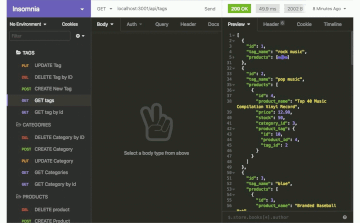
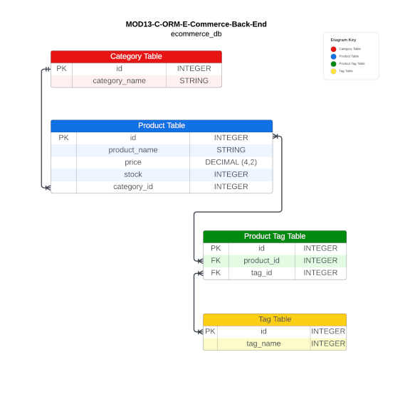

# MOD13-C-ORM-E-Commerce-Back-End
--- E-Commerce Back End application

[](https://opensource.org/licenses/MIT)

## Description

Creates the CRUD processes for and Internet retail produce database management application

## Table of Contents
  
- [User Story](#userstory)
- [Acceptance Criteria](#acceptance-criteria)
- [Visual Documentation](#visual-documentation)
- [Installation](#installation)
- [Usage](#usage)
- [Credits](#credits)
- [License](#license)
- [Feature](#features)
- [How to Contribute](#contribute)
- [How to Test](#test)
- [Contact Info](#contact)
## User Story

```md
AS A manager at an internet retail company
I WANT a back end for my e-commerce website that uses the latest technologies
SO THAT my company can compete with other e-commerce companies
```

## Acceptance Criteria

```md
GIVEN a functional Express.js API
WHEN I add my database name, MySQL username, and MySQL password to an environment variable file
THEN I am able to connect to a database using Sequelize
WHEN I enter schema and seed commands
THEN a development database is created and is seeded with test data
WHEN I enter the command to invoke the application
THEN my server is started and the Sequelize models are synced to the MySQL database
WHEN I open API GET routes in Insomnia for categories, products, or tags
THEN the data for each of these routes is displayed in a formatted JSON
WHEN I test API POST, PUT, and DELETE routes in Insomnia
THEN I am able to successfully create, update, and delete data in my database
```

## Visual Documentation

The following video shows the application being used from Insomnia app:

DEMO video 1: The GET functions for Category, Product, and Tag tables.

[](https://drive.google.com/file/d/1-ChrH9NOEWzQyPIfhW-zl0HFe7Zm80KC/view?usp=share_link)

***

A DEMO video 2: The GET by Id functions for Category, Product, and Tag tables.

[](https://drive.google.com/file/d/1dmQe1YpSUbcl8dGH-m9CDf4-FJksNojM/view?usp=share_link)

***

A DEMO video 3: The POST, PUT and DELETE functions for Category, Product, and Tag tables.

[](https://drive.google.com/file/d/1BXKKZZqOBH0nvKGfsKHHius-8LXPyVN9/view?usp=share_link)


## Visual Database Schema

The following is a visual representation of the ecommerce_db database schema.



## Installation

Initialize npm to produce the package.json file.
Type npm install to install the following: MySQL2, sequelize, express, dotenv.
 
In the command line, type npm start.
USES Insomnia to perform CRUD tasks


## Usage
- JavaScript with Node.js - base coding language
- express - to create the routers/endpoints
- dotenv - to hide the environmental variables (password/database)
- MySQL2 package - as the database dialect
- sequelize - to interpret the SQL commands
- Insomnia app - to perform the CRUD functions to the database 

## Credits

I would like to thank Erik Hoversten for tutoring me though the async/await, constructor functions, Trey Eckels for teaching about modules and everything else, my family for putting up with this crazy.

## License

This application is using the The MIT License License. Click on the badge  [](https://opensource.org/licenses/MIT)  to follow the link to the license.

---

## Features


## How to Contribute

This application follows the [Contributor Covenant](https://www.contributor-covenant.org/).

If you would like to contribute it, you can create an issue on GitHub repository at https://github.com/LRicciardo/MOD11-C-Note-Taker. 

## Tests


  
## Contact Info

This application follows the [Contributor Covenant](https://www.contributor-covenant.org/).

If you would like to contact me about an issue, you can send an email to Liane.Ricciardo@gmail.com.
